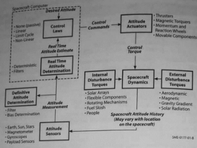
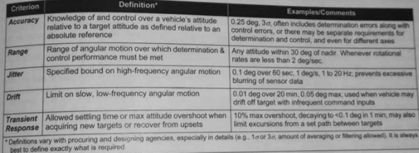
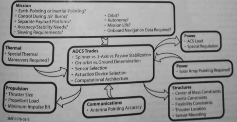

**ATTITUDE DETERMINATION AND CONTROL SYSTEM** 

[PDF link](https://drive.google.com/file/d/1c-lwYFNjlV5rP7wrAc9alryHAdpSvKOg/view?usp=drive_link)

**Introduction** 

Attitude is the three-dimensional orientation of a vehicle with respect to a specified reference frame. Attitude systems include the sensors, actuators, avionics, algorithms, software, and ground support equipment used to determine and control the attitude of a vehicle. Attitude systems can have a variety of names, such as attitude determination and control system (ADCS), attitude ground system (AGS), attitude and orbit control system (AOCS), guidance, navigation, and control (GNC), or whatever other term describes the designers' focus in achieving the attitude needs of a particular mission. When we use an acronym in this section, we will use ADCS, but any given specialist may be more familiar with other terms. 

**Fundamental terms and equation** 

Spacecraft attitude changes according to the fundamental equations of motion for rotational dynamics, the Euler equations, here expressed in vector form in the spacecraft's reference frame: 

**H’=T-**w X **h** 

(‘ means taking derivatives) 

This vector represents the conservation equations for the angular momentum, which is denoted by **H**. Recall that linear momentum is the translational motion of a body that will remain constant unless a force acts to change it, and it is calculated (in Newtonian physics anyway) as mass times velocity. Analogously, angular momentum is the rotational motion of a body that will continue unless changed by a torque, and it is calculated as the body's moment of inertia times its angular velocity (or rotation rate). The moment of inertia is a 3-by-3 matrix of values that describe the distribution of mass in a body. There is always a coordinate frame, called the principal axis frame, for which the moment of inertia matrix is diagonal. The difference between the geometric and principal axis frames is of great interest to ADCS designers, as we will see later in this section. 

Note that in the form above, the Euler equation makes it clear that the magnitude of angular momentum in a system can only be changed by applying external torques, **T**, because the change due to the term w X **H** can only change the direction of **H**, not the magnitude. The magnitude of a body's angular momentum will remain constant in the absence of external torques upon it, even when parts of the body can move with respect to other parts, such as a gyroscope spinning in its housing. If part of the body starts to spin in one direction in the absence of external torques, the rest of the body will have to spin in the opposite direction so that total angular momentum is conserved. With this in mind, we can relate the angular velocity of the spacecraft, w, to **H** by the equation: 

**H=I**w**+h** 

where I is the moment of inertia and h is the angular momentum stored by any rotating objects that are part of the spacecraft, such as momentum wheels or gyroscopes. So, by the product rule of calculus, the Euler equations can be rewritten as a matrix equation: 

**I’**w**+I**w’**+h’=T-**w X **H** or, after moving some terms around: 

**I**w’**=T**-**h**-**I’**w-w X **H** 

This form allows us to understand how attitude can change due to a variety of causes. The first term on the right-hand side represents the external torque's direct contribution to attitude dynamics, this term includes how some actuators can be used to control spacecraft attitude by creating external torques. The second term gives the relationship between changes in on-board rotating objects' speeds and changes in the spacecraft's rotational velocity; this term is where certain other control actuators enter the dynamics as so-called internal torques. The third term shows how changes in the spacecraft moment of inertia (representing how mass is distributed in the spacecraft), such as by solar array articulation, can affect attitude dynamics; in the absence of changes in mass properties, the third term disappears. The fourth term is called the gyroscopic torque, and it shows how the angular momentum appears to change direction, but not magnitude, in the space- craft's frame of reference when the spacecraft is rotating All these effects combine to determine the rate of change of the angular velocity on the left-hand side. 

**How it all works?** 

Attitude determination is the process of combining available sensor inputs with knowledge of the spacecraft dynamics to provide an accurate and unique solution for the attitude state as a function of time, either onboard for immediate use, or after the fact (i.e., post-processing). With the powerful microprocessors now available for spaceflight, most attitude algorithms that formerly were performed as post-processing can now be programmed as onboard calculations. Therefore, though there are still good engineering reasons for certain processes to be per- formed only by ground-based attitude systems, it will be sufficient to focus our attitude determination discussions in this chapter on the design and implementation of onboard systems. 

The product of attitude determination, the attitude estimate or solution, is attained by using sensors to relate information about external references, such as the stars, the Sun, the Earth, or other celestial bodies, to the orientation of the spacecraft. Frequently, any single sensor has a noise level other drawback that pre- vents it from always providing a fully satisfactory attitude solution. Therefore, more than one sensor is often required to meet all mission requirements for a given mission. 

The combination of information from multiple sensors is a complex field of study. The possibilities for any given mission range from simple logical combination of sensors, depending on mode, to modern information filtering methods, such as Kalman filtering. Many methods require some prediction of a future attitude from current conditions. Because all spacecraft sensors must use the spacecraft's reference frame as a basis for attitude determination, the development of angular momentum according to the spacecraft's frame of reference can be important for some attitude determination algorithms This is the reason for the spacecraft-referenced aspect of the Euler equations. 

Attitude control is the combination of the prediction of and reaction to a vehicle's rotational dynamics. As discussed, spacecraft exist in an environment of small and often highly predictable disturbances. Therefore, in certain cases they may be passively controlled. That is, a spacecraft may be designed in such a way that the environmental disturbances cause the spacecraft attitude to stabilize in the orientation needed to meet mission goals. Alternately, a spacecraft may include actuators that can be used to actively control the spacecraft orientation. These two general types of attitude control are not 

mutually exclusive. A spacecraft may be mostly or usually passively controlled and yet include actuators to adjust the attitude in small ways or to make attitude maneuvers (i.e., slews) to meet other objectives, such as targets of opportunity or communication needs. 

As seen earlier, external torques change the total angular momentum, and internal torques exchange momentum between different rotating parts of the space- craft. In this way reaction wheels or control moment gyroscopes may be used to change spacecraft pointing without affecting total angular momentum. Because environmental disturbances create external torques on the spacecraft, they also create angular momentum that must be either stored or removed by the attitude system. Small external torques that vary over the course of an orbit but have a mean of zero may be managed just through storage, but those torques that have a non-zero mean (secular torques) will cause a gradual increase in angular momentum, and this momentum build-up must eventually be removed with actuators that create external torques. Thrusters, magnetic torquers, or even solar trim tabs can be used to create controlled external torques on the spacecraft, thus controlling the total angular momentum. Attitude system design is an iterative process.  

**Control Modes and Requirements** 

The first step of the attitude system design process is the definition of guiding requirements based ultimately on mission goals. Since mission goals often require more than one mode of operating a spacecraft, the guiding requirements generally begin with a description of the control modes the ADCS is expected to execute to meet those goals.  

The final form of ADCS requirements and control modes will be the result of iteration; control modes are designed to achieve certain sets of requirements and better understanding of the actual needs of the mission often results from having these modes of controlling the space- craft well defined. This iteration takes place in a trade space where a single set of ADCS hardware must be used in different ways to meet different sets of requirements. 

The ADCS will also be dependent on certain other subsystems, such as the power and structural subsystem. Attitude needs will also impose requirements on other subsystems, such as propulsion, thermal control, and structural stability. 

Different mission needs may impose different requirements on the ADCS. One such critical need for many missions is orbit control. For many spacecrafts the ADCS must control vehicle attitude during the firing of large liquid or solid rocket motors for orbit insertion or management. Large motors can create large disturbance torques, which can drive the design to larger actuators than may be needed for the rest of the mission. 

Once the spacecraft is on station, the payload pointing requirements usually dominate. These may require planet-relative or inertial attitudes and fixed or spinning fields of view. There is usually also a need for attitude slew maneuvers, and the frequency and speed of those maneuvers must be defined. Reasons for slews can include: 

- Acquiring the desired spacecraft attitude initially or after a failure 
- Repointing the payload's sensing systems to tar- gets of opportunity or for calibration purposes. 
- Tracking stationary or moving targets, including communication stations 
- directing the vehicle's strongest motor to the prop er direction relative to orbital motion 

